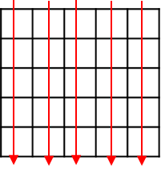
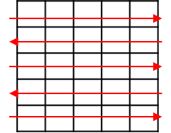
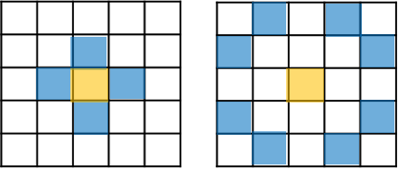

# 2차 배열 순회


- 2차 배열에서 자주 사용하는 순회 패턴들에 대해 연습해두자.

## 행우선 순회


::: code-group

```python [python]
arr = [[ 1,  2,  3,  4,  5],
    [ 6,  7,  8,  9, 10],
    [11, 12, 13, 14, 15],
    [16, 17, 18, 19, 20],
    [21, 22, 23, 24, 25]]

N, M = len(arr), len(arr[0])    # N: 행크기, M: 열크기

for i in range(N):
    for j in range(M):
        print('%2d ' % arr[i][j], end='')
    print()
```

```C [C]

```

:::


## 열우선 순회



::: code-group

```python [python]
arr = [[1, 5, 9, 13, 17],
[2,  6, 10, 14, 18],
[3,  7, 11, 15, 19],
[4,  8, 12, 16, 20]]

N, M = len(arr), len(arr[0])
for i in range(M):
    for j in range(N):
        print('%2d ' % arr[j][i], end='')
    print()
```

```C [C]

```

:::


### 지그재그 순회



::: code-group

```python [python]
arr = [[ 1,  2,  3,  4,  5],
    [10,  9,  8,  7,  6],
    [11, 12, 13, 14, 15],
    [20, 19, 18, 17, 16],
    [21, 22, 23, 24, 25]]

N, M = len(arr), len(arr[0])
for i in range(N):
    if i & 1 == 0:              # 짝수행
        for j in range(M):
            print('%2d ' % arr[i][j], end='')
    else:                       # 홀수행
        for j in range(M - 1, -1, -1):
            print('%2d ' % arr[i][j], end='')
    print()
```

```C [C]

```

:::


### 대각 순회


- N = 행 크기, M = 열 크기
- 사선의 수 = N + M - 1, 즉, 사선의 시작 좌표가 **N + M - 1** 개 존재한다.

!!! note "대각선의 시작 위치"

    - 처음 M개의 사선의 행값은 0 이고 열값은 1씩 증가한다.
    - 나머지 사선들의 행값은 1부터 시작해서 1씩 증가하고, 열값은 **M - 1** 로 고정된다.

- 다음 예제는 우상단에서 좌하단으로 가는 대각 순회에 대한 예이다.

::: code-group

```python [python]
arr = [[ 1,  2,  4,  7, 11],
    [ 3,  5,  8, 12, 15],
    [ 6,  9, 13, 16, 18],
    [10, 14, 17, 19, 20]]

N, M = len(arr), len(arr[0])
for diag in range(0, N + M - 1):    # diag: 사선의 수
                                    # x, y: 시작 좌표
    x = 0 if diag < M else (diag - M + 1)
    y = diag if diag < M else M - 1

    while x < N and y >= 0:         # 경계 체크
        print('%2d ' % arr[x][y], end='')
        x += 1
        y -= 1
    print()
```

```C [C]

```

:::


### 대각선 또는 테두리 순회


- 어떻게 할 수 있을지 생각해 봅시다.


### 사각 영역 순회

- N X N 배열에서 M X M 크기의 사각 영역을 탐색해보자. (N >= M)
- 가능한 모든 사각 영역들의 좌상단 좌표들에 대해서 작업을 수행한다.


- 가능한 모든 사각 영역들의 좌상단 좌표는 (0, 0) 에서 (N - M, N - M) 범위가 된다.

::: code-group

```python [python]

arr = [[ 1,  2,  3,  4,  5],
    [ 6,  7,  8,  9, 10],
    [11, 12, 13, 14, 15],
    [16, 17, 18, 19, 20],
    [21, 22, 23, 24, 25]]

N, M = len(arr), 3             

for i in range(N - M + 1):
    for j in range(N - M + 1):

        for x in range(i, i + M):   # 좌상단 (i, j)이고 크기가 M인 사각영역
            for y in range(j, j + M):
                print('%2d ' % arr[x][y], end='')
            print()
        print('-------------------')
```

```C [C]

```

:::


### 기준점에서 순회





1. 기준점의 상하좌우 네 곳 순회
1. 체스 게임의 **Knight** 의 현재 위치에서 이동이 가능한 곳
1. 그외, 다양한 문제에 활용이 가능

::: code-group

```python [python]
arr = [[ 1,  2,  3,  4],
    [ 5,  6 , 7,  8],
    [ 9, 10, 11, 12],
    [13, 14, 15, 16]]

N = len(arr)
dx = [0, 0, 1, -1]  # 우, 좌, 하, 상
dy = [1, -1, 0, 0]

for x in range(N):  # x: 행, y: 열
    for y in range(N):

        for i in range(4):          
            tx, ty = x + dx[i], y + dy[i]
            if tx < 0 or tx == N or ty == N or ty < 0:  # 경계 체크
                continue

            print(arr[tx][ty], end=' ')
        print()
```

```C [C]

```

:::


## 기준점의 상하좌우로 계속 탐색


::: code-group

```python [python]
N = 5
arr = [[0] * N for _ in range(N)]

dx = [0, 0, 1, -1]  # 우, 좌, 하, 상
dy = [1, -1, 0, 0]

x, y = 2, 1         # 기준점
arr[x][y] = 1

for i in range(4):
    tx, ty = x + dx[i], y + dy[i]
    while 0 <= tx < N and 0 <= ty < N:
        arr[tx][ty] = 1
        tx, ty = tx + dx[i], ty + dy[i]

for lst in arr:
    print(*lst)
```

```C [C]

```

:::